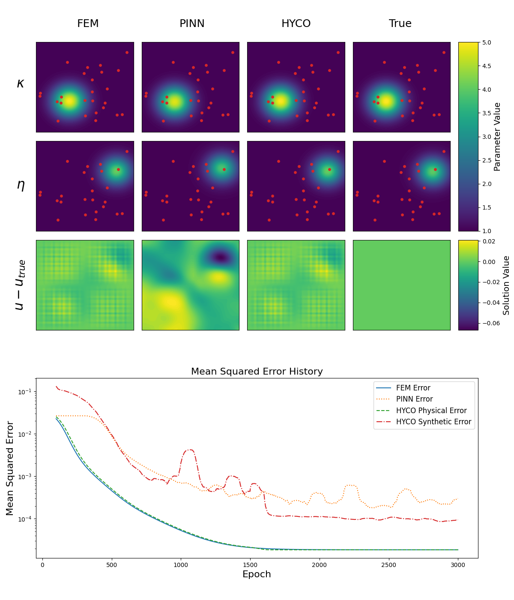
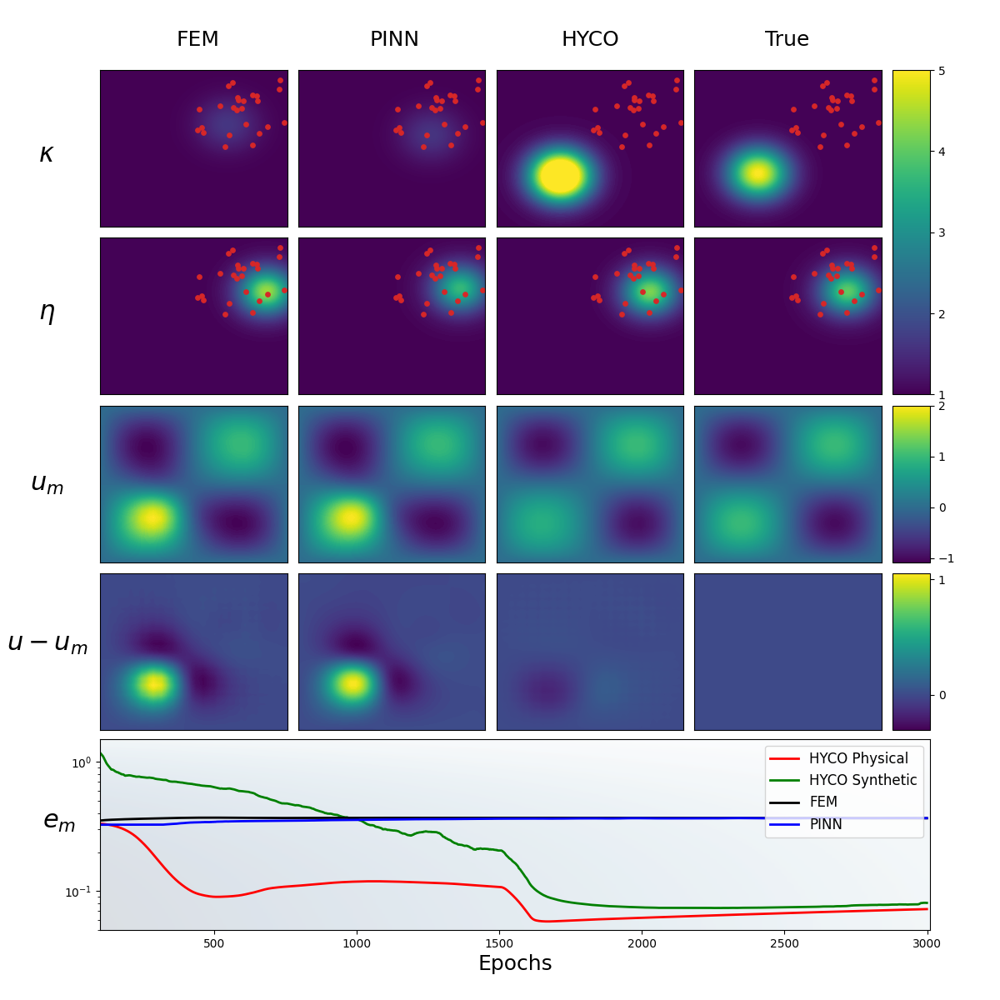

# Static Hybrid Modelling

This repository hosts a series of experiments on hybrid modelling of Poisson and Helmholtz equations using a physics-based model, a synthetic (neural network) model, and a PINN (Physics-Informed Neural Network) variant. The main experiments are implemented in [`src/experiment_baseline.py`, `src/experiment_1.py`, `src/experiment_2.py`, `src/poisson_1.py`](src/experiment_baseline.py, src/experiment_1.py, src/experiment_2.py, src/posson_1.py), which contains three training strategies:

- **Hybrid Training:** Jointly trains the physics and synthetic models.
- **Physics-only Training:** Updates only the physics model parameters.
- **PINN Training:** Combines a PDE residual loss with a supervised data loss and freezes physics updates if the PDE loss exceeds a user-defined threshold.

## Workspace Structure

- **README.md** – This file.
- **src/**
  - `experiment_1.py` – Experiment focusing on subdomain sensor placement:
    - Initializes a high-resolution "true" Helmholtz solution.
    - Defines Gaussian coefficient functions (`gaussian_kappa` and `gaussian_eta`).
    - Sets up training data on a defined subdomain.
    - Implements three training functions: `hybrid_training()`, `phys_training()`, and `pinn_training()`.
    - Saves experiment results in [`src/results/experiment_1/`](src/results/experiment_1/).
  - `experiment_2.py` – Experiment focusing on accurate PDE reconstruction:
    - Initializes a high-resolution "true" Helmholtz solution.
    - Defines Gaussian coefficient functions (`gaussian_kappa` and `gaussian_eta`).
    - Sets up training data on a defined subdomain.
    - Implements three training functions: `hybrid_training()`
    - Saves experiment results in [`src/results/experiment_1/`](src/results/experiment_1/).
  - `experiment_baseline.py` – Experiment showing in a baseline setting, all models perform well:
    - Initializes a high-resolution "true" Helmholtz solution.
    - Defines Gaussian coefficient functions (`gaussian_kappa` and `gaussian_eta`).
    - Sets up training data on the entire domain.
    - Implements three training functions: `hybrid_training()`, `phys_training()`, and `pinn_training()`.
    - Saves experiment results in [`src/results/experiment_baseline/`](src/results/experiment_baseline/).
  - `Poisson_1.py` – Experiment focusing on subdomain sensor placement:
    - Initializes a high-resolution "true" Helmholtz solution.
    - Defines Gaussian coefficient functions (`gaussian_kappa` and `gaussian_eta`).
    - Sets up training data on a defined subdomain.
    - Implements three training functions: `hybrid_training()`, `phys_training()`, and `pinn_training()`.
    - Saves experiment results in [`src/results/experiment_1/`](src/results/experiment_1/).
  - **examples/**
    - `training_PM.py` - Example of training a physical model.
    - `training_SM.py` - Example of training a synthetic model.
  - **files/**
    - **experiment_1/** – Contains saved output files (e.g., `helmholtz_hybrid_loss.npy`, `helmholtz_phys_loss.npy`, `helmholtz_pinn_loss.npy`, etc.) generated by Experiment 1.
    - **experiment_2/** – Contains saved output files generated by Experiment 2.
    - **experiment_baseline/** – Contains saved output files generated by Experiment baseline.
    - **posson_1/** – Contains saved output files generated by poisson 1.
- **models/**
  - `other_models.py` – Implements other models such as PINN.
  - `physical_model.py` – Implements the physics based models.
  - `synthetic_model.py` – Implements the synthetic based models.
- **results/**
    - **experiment_1/** – Contains saved output plots generated by Experiment 1.
    - **experiment_2/** – Contains saved output plots generated by Experiment 2.
    - **experiment_baseline/** – Contains saved output plots generated by Experiment baseline.
    - **posson_1/** – Contains saved output plots generated by poisson 1.
- **tools/**
  - `finite_element_method.py` – Contains functions for setting up the finite element discretization of a problem.
  - `gif_editing.py` – Used for post-processing the animations.
  - `plotting.py` – Contains plotting and animation routines for visualizing training results.
  - `symbolic.py` – Contains symbolic code for finding a forcing term.
  - `training.py` – Provides supporting functions for training.

## Experiment Details

### True Model Initialization

- **Objective:** Generate a high-resolution "true solution" using a Helmholtz model with Gaussian coefficient functions.
- **Details:**
  - True model parameters are defined as a six-element JAX array.
  - The training subdomain is sampled from a grid over a defined region.
  - This solution is used as a reference for the training experiments.

### Hybrid Training

- **Objective:** Simultaneously train the physics and synthetic models.
- **Methodology:**
  - Compute a combined loss that scales the physics loss and includes a hybrid component.
  - Uses alternating updates where synthetic model updates occur multiple times per physics update.
- **Output:** Saves hybrid loss and parameter state histories in the appropriate src/files/experiment folder.

### Physics-only Training

- **Objective:** Update only the physics model.
- **Methodology:**
  - The loss is computed solely from the physics component; the synthetic loss is ignored.
- **Output:** Saves physics loss and parameter state histories in the appropriate src/files/experiment folder.

### PINN Training

- **Objective:** Enhance training with a supervised data loss while enforcing the physics-induced PDE residual.
- **Methodology:**
  - Collocation points are generated over the domain.
  - The loss function comprises:
    - PDE loss (mean squared error of the PDE residual).
    - Supervised data loss (difference between the synthetic model prediction and the true solution).
  - If the computed PDE loss exceeds a threshold (set to 1e-1), the physics parameters are not updated.
- **Output:** Saves PINN loss and parameter state histories in the appropriate src/files/experiment folder.

## Explanitory Tools

## Experiment Results

### Baseline:

### Experiment 1:

### Poisson 1: 

